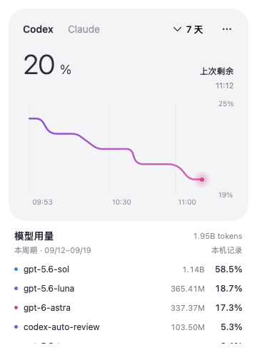
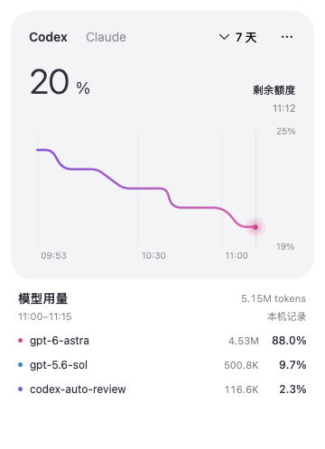
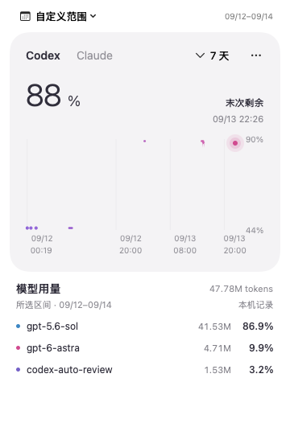

# UsageBar

> A small, local-first macOS menu bar companion for Codex and Claude Code usage.



UsageBar keeps two questions separate:

1. **How much account quota remains?** Read from the provider's current quota endpoint and shown as a soft, time-based curve.
2. **Which models used this Mac, and by how much?** Calculated from local session logs, with token totals and model shares.

That distinction is intentional. Local token history is useful for understanding model mix, but it cannot be used to reverse-engineer an account's subscription quota, especially when the same account is used on more than one device.

## What it does

- Native SwiftUI menu bar app with no third-party Swift dependencies.
- Shows remaining quota for Codex and Claude Code, including reset time when available.
- Draws real quota samples with a smooth, rounded line; gaps and quota resets remain visible instead of being invented away.
- Selects `Today`, `Last 7 days`, `Current cycle`, or a custom local date/time range.
- Shows model token totals and percentages for the selected range when the cursor is away from the chart.
- Shows the selected chart time slice while hovering, then returns to the range summary when the pointer leaves.
- Keeps the model detail area at a fixed height so changing time points does not move the panel.
- Caches parsed usage metadata by file size and modification time; pointer movement never rereads logs.
- Supports light and dark macOS appearance.

## Screenshots

| Default range summary | Selected time slice | Custom range |
| --- | --- | --- |
|  |  |  |

## Requirements

- macOS 13 or later
- Xcode Command Line Tools (Swift 5.9 or newer)
- Python 3 available at `/usr/bin/python3`
- Optional: Codex CLI, logged in with `codex login`
- Optional: Claude Code with a Claude.ai Pro or Max subscription

The checked-in app is source-only. `UsageBar.app`, Swift build output and local caches are ignored by Git. The included build script creates a local ad-hoc signed app for personal use; it is not notarized.

## Build and run

```sh
git clone https://github.com/canaanyjn/usagebar.git
cd usagebar
./scripts/build.sh
open UsageBar.app
```

For a package-only build:

```sh
swift build -c release
```

## Connect data sources

### Codex

UsageBar starts the local Codex app server and calls `account/rateLimits/read`. It checks the normal `PATH`, Homebrew locations and common nvm locations. Credentials are handled by the existing Codex CLI; UsageBar does not copy or store them.

```sh
codex login
```

The account quota curve is provider data. It may include usage from other devices or sessions that are not present in local logs.

### Claude Code

Choose **Connect / update Claude Code** in the `…` menu, then restart Claude Code and send a message. Claude Code exposes `rate_limits.five_hour` and `rate_limits.seven_day` to its status-line command; UsageBar records those fields locally.

The connector:

- preserves the rest of `~/.claude/settings.json`;
- backs up the previous settings and status-line value under `~/Library/Application Support/UsageBar/`;
- chains an existing command status line where it is safe to do so;
- writes only quota metadata and timestamps, never prompts or response text.

Claude quota history begins after the connector is active and Claude Code has produced a response. Older history cannot be reconstructed from a missing status-line sample.

## How the numbers are calculated

### Account quota curve

The curve uses real provider snapshots. It displays **remaining percentage** (`100 - used`) and never treats missing data as 100% remaining. The first real sample is always labelled on the x-axis. A gap longer than 30 minutes, or a confirmed quota reset, breaks the line. One-second reset timestamp rounding does not create a false new cycle.

Multiple local Codex sessions can report an old snapshot after another session has already received a newer one. Once direct sampling starts for a provider/window, later session snapshots are used only as historical backfill; they cannot create a false rebound.

### Model token summary

Model totals are derived from local Codex and Claude session metadata. The current-cycle summary uses the provider-reported reset time minus its window duration. Explicit date ranges use their own local start and end boundaries; the start is inclusive and the end is exclusive.

Token totals include input, cache reads and output. Claude cache creation is counted as input. Codex cache reads are split out of input. Streaming records and duplicated files are deduplicated by response/message ID where available.

The summary is a local observation, not a billing statement. It does not claim that a model's token share equals its share of subscription quota consumption.

## Project layout

```text
Package.swift
Sources/UsageBar/
  UsageBar.swift       # menu bar lifecycle, refresh and provider state
  HistoryView.swift    # quota chart, range summary and model breakdown
  HistoryRange.swift   # date presets and custom date picker
scripts/
  usage.py             # Codex quota adapter and Claude cache reader
  history.py           # local log parser, range aggregation and caches
  claude-hook.py       # Claude status-line adapter
  connect.py           # safe Claude settings integration
  build.sh             # local app bundle build
  test_history.py      # parser and range tests
  test_integration.py  # settings and hook tests
```

## Test

```sh
python3 scripts/test_history.py
python3 scripts/test_integration.py
swift build -c release
```

The tests cover multi-day ranges, custom end boundaries, daylight-saving date calculations, multiple quota windows, stale session snapshots, genuine resets, cache invalidation, duplicate records, Claude settings preservation and latest-request-wins behavior. The native review harness also checks remaining-value semantics, chart/selection separation, hover exit behavior and fixed-height model lists.

## Privacy and limitations

UsageBar is local-first, but it reads local session metadata and writes quota snapshots to your user Library directory. Review the source before using it on a managed machine. No telemetry, network service or account database is included.

The app does not provide API spending, monetary cost estimates, notifications, launch-at-login, cross-device token history or a provider-independent quota formula. Provider APIs and CLI fields can change; missing fields are shown as unavailable rather than guessed.

## Remove the Claude connector

Quit UsageBar. Restore the `statusLine` value from `~/Library/Application Support/UsageBar/previous-statusline.json` in `~/.claude/settings.json`; if the saved value is `null`, remove the field. Edit only that field so later Claude settings are preserved, then remove the app and the UsageBar support directory if desired.

## Contributing

Issues and pull requests are welcome. Keep provider adapters isolated, preserve the distinction between account quota and local token observations, and add a fixture before changing parsing or date-boundary behavior.

## License

MIT. See [LICENSE](LICENSE).

## Provider documentation

- [Codex App Server](https://learn.chatgpt.com/docs/app-server) — `account/rateLimits/read`
- [Claude Code status line](https://code.claude.com/docs/en/statusline) — `rate_limits.five_hour` and `rate_limits.seven_day`
